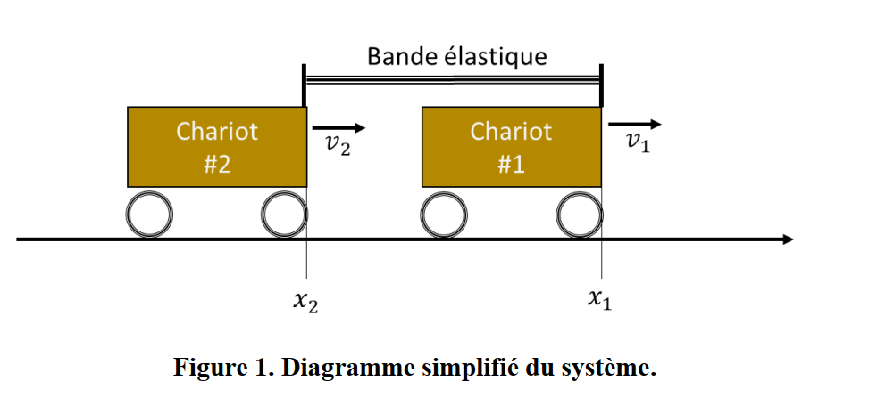
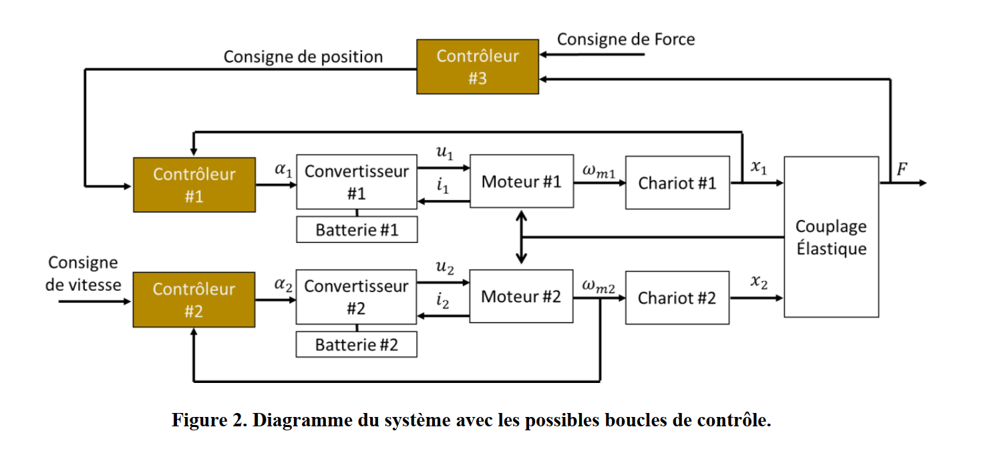

# GEI1013 — Asservissements Linéaires | Projet de Conception H2026


> Modélisation, analyse et synthèse d'un système d'asservissement en **cascade à 3 boucles** (force → position → vitesse) pour un actionneur moteur CC – réducteur – chariot – ressort élastique.  
> Chaque module est documenté de façon **progressive et pédagogique** pour mettre en évidence les notions fondamentales de la théorie de commande.

---

## Système physique



---

## Schéma fonctionnel du système



---

## Architecture de commande — Cascade à 3 boucles

```
   Fréf ──► [C3 : I] ──► xréf ──► [C1 : Lead] ──► αréf ──► [C2 : I+Lead] ──► α ──► SYSTÈME ──► x ──► F
              Force                  Position                  Vitesse
            ωcp = 2.5 rad/s        ωcp = 15 rad/s           ωcp = 50 rad/s
              (lent)                  (moyen)                    (rapide)
```

> **Règle de séparation :** chaque boucle est **5× plus lente** que la boucle interne qu'elle englobe, garantissant leur découplage dynamique.

---

## Carte des notions d'asservissement couvertes

| # | Notion | Description | Module |
|---|--------|-------------|--------|
| 1 | Transformée de Laplace | Passage domaine temporel → fréquentiel | [01](01_Modelisation_Systeme/) |
| 2 | Fonction de transfert (FT) | Rapport Y(s)/U(s) à conditions initiales nulles | [01](01_Modelisation_Systeme/) |
| 3 | Schéma bloc | Représentation graphique des FT interconnectées | [01](01_Modelisation_Systeme/) |
| 4 | Blocs internes (couplage) | Interaction convertisseur–moteur via Z·Y | [01](01_Modelisation_Systeme/) |
| 5 | Inertie équivalente | Ramener les masses au référentiel moteur | [01](01_Modelisation_Systeme/) |
| 6 | Pôles et zéros | Racines du dénominateur / numérateur de H(s) | [02](02_Analyse_Frequentielle/) |
| 7 | Critère de stabilité | Pôles à partie réelle strictement négative | [02](02_Analyse_Frequentielle/) |
| 8 | Amortissement ξ | Lien entre pôles complexes et oscillations | [02](02_Analyse_Frequentielle/) |
| 9 | Diagramme de Bode | Gain [dB] et phase [°] en fonction de ω | [02](02_Analyse_Frequentielle/) |
| 10 | Marge de phase (Pm) | Retard de phase avant instabilité à ωcp | [02](02_Analyse_Frequentielle/) |
| 11 | Marge de gain (Gm) | Amplification avant instabilité à ωcg | [02](02_Analyse_Frequentielle/) |
| 12 | Lieu des racines | Trajectoire des pôles BF en fonction du gain | [02](02_Analyse_Frequentielle/) |
| 13 | Réponse indicielle | Sortie y(t) pour une entrée échelon unitaire | [03](03_Analyse_Temporelle/) |
| 14 | Dépassement D% | Écart relatif au-delà de la valeur finale | [03](03_Analyse_Temporelle/) |
| 15 | Temps de réponse Ts | Temps pour rester dans ±5% de y∞ | [03](03_Analyse_Temporelle/) |
| 16 | Classe du système | Nombre d'intégrateurs en boucle ouverte | [03](03_Analyse_Temporelle/) |
| 17 | Erreur statique | Erreur résiduelle en régime permanent | [03](03_Analyse_Temporelle/) |
| 18 | Erreur de traînage (Kv) | Erreur à une rampe pour système de classe 1 | [03](03_Analyse_Temporelle/) |
| 19 | Réseau d'avance de phase | Correcteur Lead : ajoute de la phase à ωcp | [04](04_Synthese_Correcteurs/) |
| 20 | Action intégrale | Élimine l'erreur statique, ajoute −90° de phase | [04](04_Synthese_Correcteurs/) |
| 21 | Correcteur I + Avance (C2) | Boucle vitesse : intégrale + réseau d'avance | [04](04_Synthese_Correcteurs/) |
| 22 | Correcteur Lead seul (C1) | Boucle position : avance de phase pure | [04](04_Synthese_Correcteurs/) |
| 23 | Correcteur intégral pur (C3) | Boucle force : asservissement de force | [04](04_Synthese_Correcteurs/) |
| 24 | Méthode de Bode (synthèse) | Calcul analytique de α, T, K à partir du diagramme | [04](04_Synthese_Correcteurs/) |
| 25 | Commande en cascade | Imbrication de boucles pour contrôler plusieurs variables | [05](05_Commande_Cascade/) |
| 26 | Séparation des bandes passantes | Condition ωcp_externe ≪ ωcp_interne | [05](05_Commande_Cascade/) |

---

## Parcours d'apprentissage recommandé

```
┌─────────────────┐     ┌─────────────────┐     ┌─────────────────┐
│   MODULE 01     │ ──► │   MODULE 02     │ ──► │   MODULE 03     │
│ Modélisation    │     │ Analyse         │     │ Analyse         │
│ (FT, blocs)     │     │ fréquentielle   │     │ temporelle      │
│                 │     │ (Bode, marges)  │     │ (step, erreurs) │
└─────────────────┘     └─────────────────┘     └────────┬────────┘
                                                          │
                        ┌─────────────────┐     ┌────────▼────────┐
                        │   MODULE 05     │ ◄── │   MODULE 04     │
                        │ Commande        │     │ Synthèse des    │
                        │ en cascade      │     │ correcteurs     │
                        │ (architecture)  │     │ (Lead, I, I+L)  │
                        └─────────────────┘     └─────────────────┘
```

---

## Structure du dépôt

```
GEI1013-Asservissement/
├── README.md                          ← Ce fichier (vue d'ensemble)
├── CONCEPTS.md                        ← Glossaire complet des notions
├── projet_session.mlx                 ← Script MATLAB Live (code complet)
├── Modele_Projet_H2026_Gabarit.slx   ← Modèle Simulink
├── Rapport_projet_session.pdf         ← Rapport final
├── GEI1013_ProjetConception_H2026.pdf ← Cahier des charges
│
├── 01_Modelisation_Systeme/
│   ├── README.md                      ← Théorie : FT, blocs internes
│   └── 01_modelisation.m             ← Script MATLAB commenté
│
├── 02_Analyse_Frequentielle/
│   ├── README.md                      ← Théorie : Bode, marges, lieu des racines
│   └── 02_analyse_frequentielle.m    ← Script MATLAB commenté
│
├── 03_Analyse_Temporelle/
│   ├── README.md                      ← Théorie : step, classe, erreurs
│   └── 03_analyse_temporelle.m       ← Script MATLAB commenté
│
├── 04_Synthese_Correcteurs/
│   ├── README.md                      ← Théorie : Lead, I, I+Lead, méthode Bode
│   ├── 04a_correcteur_vitesse.m      ← C2 : I + Avance (ωcp = 50 rad/s)
│   ├── 04b_correcteur_position.m     ← C1 : Lead seul (ωcp = 15 rad/s)
│   └── 04c_correcteur_force.m        ← C3 : Intégrateur pur (ωcp = 2.5 rad/s)
│
└── 05_Commande_Cascade/
    ├── README.md                      ← Théorie : cascade, séparation des BP
    └── 05_cascade_complet.m          ← Assemblage des 3 boucles
```

---

## Prérequis

- **MATLAB** R2021a ou plus récent
- **Toolbox requise** : Control System Toolbox (`tf`, `bode`, `margin`, `step`, `feedback`)
- Notions de base en **transformée de Laplace**
- Connaissance élémentaire des **circuits électriques RLC** et des **moteurs CC**

---

## Paramètres du système

| Symbole | Valeur | Unité | Signification |
|---------|--------|-------|---------------|
| `uB` | 24 | V | Tension d'alimentation bus continu |
| `Lm` | 1.577×10⁻³ | H | Inductance de l'induit |
| `Rm` | 1.3 | Ω | Résistance de l'induit |
| `km = kv` | 0.0742 | V·s/rad / N·m/A | Constantes électromécaniques |
| `Jr` | 1.558×10⁻⁴ | kg·m² | Inertie du rotor |
| `M` | 2.5 | kg | Masse du chariot |
| `G` | 20 | — | Rapport de réduction |
| `r` | 0.125 | m | Rayon de la poulie |
| `Bm` | 1.5×10⁻³ | N·m·s/rad | Frottement visqueux |
| `Lf` | 50×10⁻⁶ | H | Inductance du filtre LC |
| `Cf` | 300×10⁻⁶ | F | Capacité du filtre LC |
| `Rf` | 100×10³ | Ω | Résistance de charge du filtre |
| `k_elas` | 50 | N/m | Raideur de la bande élastique |

---

## Résultats de conception

| Boucle | Correcteur | ωcp cible | Marge de phase cible | Structure |
|--------|-----------|-----------|---------------------|-----------|
| Vitesse (C2) | I + Avance | 50 rad/s | ≥ 50° | $C_2(s) = \frac{K}{s}\cdot\frac{Ts+1}{\alpha Ts+1}$ |
| Position (C1) | Lead | 15 rad/s | ≥ 50° | $C_1(s) = K_p\cdot\frac{Ts+1}{\alpha Ts+1}$ |
| Force (C3) | Intégrateur | 2.5 rad/s | ≥ 50° | $C_3(s) = \frac{K_i}{s}$ |

---

## Figures et résultats

> **Générer les figures :** exécuter `export_figures.m` dans MATLAB pour produire tous les graphiques ci-dessous dans le dossier `figures/`.

### Analyse fréquentielle — Boucles non corrigées

#### Carte des pôles et zéros

| Boucle vitesse | Boucle position |
|:-:|:-:|
|  |  |
| $G_{BO\_v}$ — classe 0, ordre 4 | $G_{BO\_p}$ — classe 1, ordre 5 |

> **Observation :** tous les pôles sont dans le demi-plan gauche (partie réelle < 0), ce qui confirme que les deux boucles ouvertes sont **stables en elles-mêmes**. On note la présence d'une paire de pôles complexes conjugués à haute fréquence (filtre LC très peu amorti, $\xi \approx 2\times10^{-4}$) et de pôles réels lents liés à la mécanique du moteur-chariot. La boucle position possède un pôle supplémentaire en $s=0$ (l'intégrateur cinématique $r/Gs$), ce qui la rend de classe 1.
>
> **Ce qu'il reste à vérifier :** la stabilité des pôles en boucle **fermée** dépend du gain appliqué — un gain trop élevé peut déplacer les pôles vers le demi-plan droit. C'est ce que montre le lieu des racines ci-dessous.

---

#### Diagrammes de Bode et marges de stabilité

| Bode vitesse (non corrigé) | Bode position (non corrigé) |
|:-:|:-:|
|  |  |
| Marges de $G_{BO\_v}$ | Marges de $G_{BO\_p}$ |

> **Observation :** les diagrammes de Bode révèlent les marges de stabilité des boucles ouvertes **sans correcteur**. La marge de phase ($P_m$) indique le retard de phase supplémentaire tolérable avant instabilité. Une marge trop faible ($P_m < 45°$) se traduit par des oscillations importantes ou une instabilité en boucle fermée.
>
> **Problème identifié :** la marge de phase obtenue sans correcteur est insuffisante pour atteindre les spécifications ($P_m \geq 50°$). De plus, la boucle vitesse ($G_{BO\_v}$, classe 0) présente une **erreur statique non nulle** à un échelon de consigne — son gain statique est fini, ce qui empêche d'atteindre parfaitement la référence en régime permanent.
>
> **Remède prévu :** synthétiser un correcteur pour chaque boucle (voir section Synthèse) afin d'imposer simultanément la pulsation de coupure $\omega_{cp}$ cible et la marge de phase $\geq 50°$.

---

#### Lieu des racines

| Lieu des racines vitesse | Lieu des racines position |
|:-:|:-:|
|  |  |

> **Observation :** le lieu des racines montre comment les pôles en **boucle fermée** se déplacent dans le plan complexe quand on augmente le gain $K$ de 0 à $+\infty$. Pour $K=0$, les pôles BF coïncident avec les pôles BO. À mesure que $K$ croît, certaines branches migrent vers le demi-plan droit, signalant une **instabilité par gain excessif**.
>
> **Interprétation :** il existe une valeur maximale de gain à ne pas dépasser. Le correcteur Lead (réseau d'avance de phase) a précisément pour effet de replier ces branches vers la gauche, élargissant la marge de gain utilisable et permettant des bandes passantes plus élevées sans déstabiliser le système.

---

### Analyse temporelle — Réponses sans correcteur

| Échelon BO vitesse | Échelon BF vitesse (gain=1) | Échelon BF position (gain=1) |
|:-:|:-:|:-:|
|  |  |  |

> **Observation — Boucle ouverte vitesse :** sans rétroaction, la vitesse monte librement sans jamais se stabiliser à une valeur précise. Il n'y a aucun mécanisme de correction de l'erreur.
>
> **Observation — Boucle fermée vitesse (sans correcteur) :** la vitesse se stabilise mais **n'atteint pas la valeur de référence 1** — il subsiste une erreur statique permanente. Ceci est la conséquence directe du fait que $G_{BO\_v}$ est de **classe 0** : le gain statique $K_p$ est fini, donc l'erreur est $\varepsilon = 1/(1+K_p) \neq 0$.
>
> **Observation — Boucle fermée position (sans correcteur) :** la position atteint bien la valeur finale de 1 (erreur nulle à l'échelon grâce à la classe 1), mais le **dépassement et le temps de réponse** peuvent ne pas respecter les spécifications.
>
> **Remède prévu :** le correcteur C2 (boucle vitesse) intègre une action **intégrale** (terme $K/s$) qui élève la classe de 0 à 1, annulant ainsi l'erreur statique. Le réseau d'avance associé compense les −90° de phase introduits par cet intégrateur pour maintenir la marge de phase à 50°.

---

### Synthèse des correcteurs — Validation

#### Boucle vitesse C₂ (I + Avance, ωcp = 50 rad/s)

| Bode BO corrigée | Réponse indicielle BF |
|:-:|:-:|
|  |  |

> **Observation — Bode :** après correction, la courbe de gain croise 0 dB exactement à $\omega_{cp} = 50$ rad/s et la marge de phase atteint $\geq 50°$. L'action intégrale ($K/s$) est visible dans la montée du gain en basses fréquences (pente −20 dB/décade), garantissant une erreur statique nulle. Le réseau d'avance apporte le surcroît de phase nécessaire autour de $\omega_{cp}$ pour compenser le retard introduit par cet intégrateur.
>
> **Observation — Step BF :** la vitesse suit la consigne sans erreur en régime permanent, avec un dépassement $\leq 16\%$ et un temps de réponse conforme aux spécifications — les deux critères attendus d'une marge de phase de 50°.

---

#### Boucle position C₁ (Lead, ωcp = 15 rad/s)

| Bode BO corrigée | Réponse indicielle BF |
|:-:|:-:|
|  |  |

> **Observation — Bode :** la boucle position contient déjà un intégrateur naturel (cinématique $r/Gs$), donc la pente du gain est déjà de −20 dB/décade en basses fréquences. Le correcteur Lead seul (sans intégrateur supplémentaire) suffit à relever la phase à $\omega_{cp} = 15$ rad/s et à placer la coupure à la fréquence cible.
>
> **Observation — Step BF :** la position atteint la valeur de référence sans erreur statique (classe 1 conservée), avec un dépassement et un temps de réponse maîtrisés. La bande passante de 15 rad/s est volontairement **3× plus lente** que la boucle vitesse (50 rad/s) pour assurer leur découplage dynamique.

---

#### Boucle force C₃ (Intégrateur, ωcp = 2.5 rad/s)

| Bode G_sys3 (avant correction) | Bode BO corrigée | Réponse indicielle BF |
|:-:|:-:|:-:|
|  |  |  |

> **Observation — Bode avant correction :** la plante $G_{sys3} = k_{elas} \times T_{position}$ hérite déjà de la dynamique de la boucle position fermée. Elle présente une phase naturellement en retard, mais la marge disponible permet d'y ajouter un intégrateur pur.
>
> **Observation — Bode après correction :** le correcteur $C_3(s) = K_i/s$ place la coupure à $\omega_{cp} = 2.5$ rad/s avec une marge de phase suffisante. La bande passante est volontairement **très faible** (6× plus lente que la boucle position) pour deux raisons : ① ne pas exciter les modes de résonance du ressort élastique et ② respecter la règle de séparation des bandes passantes de la commande en cascade.
>
> **Observation — Step BF :** la force dans la bande élastique suit la référence sans erreur statique (l'intégrateur $K_i/s$ annule l'erreur à l'échelon), mais avec un temps de réponse lent (~4–8 s), ce qui est voulu et acceptable pour une boucle de force externe.

---

### Commande en cascade — Vue globale

| Réponses indicielles des 3 boucles | Comparaison des gains en BO |
|:-:|:-:|
|  |  |

> **Observation — Réponses en cascade :** les trois boucles fermées répondent chacune à leur référence avec les performances spécifiées. On note clairement les **échelles de temps différentes** : la boucle vitesse est la plus rapide (~0.1 s), la position est intermédiaire (~1 s), et la force est la plus lente (~5–10 s). Cette hiérarchie est fondamentale : si les boucles avaient des vitesses comparables, leurs dynamiques interagiraient et les hypothèses de conception ne seraient plus valides.
>
> **Observation — Comparaison des Bode BO corrigées :** le graphique superpose les trois courbes de gain. La **séparation des pulsations de coupure** ($\omega_{cp} = 2.5$, $15$ et $50$ rad/s) est clairement visible — chaque boucle croise 0 dB à sa fréquence cible, bien séparée de ses voisines. C'est la signature visuelle du bon découplage de la cascade : chaque boucle "voit" ses voisines comme des gains unitaires dans sa propre bande passante, ce qui valide rétrospectivement les hypothèses de conception indépendante de chaque correcteur.
